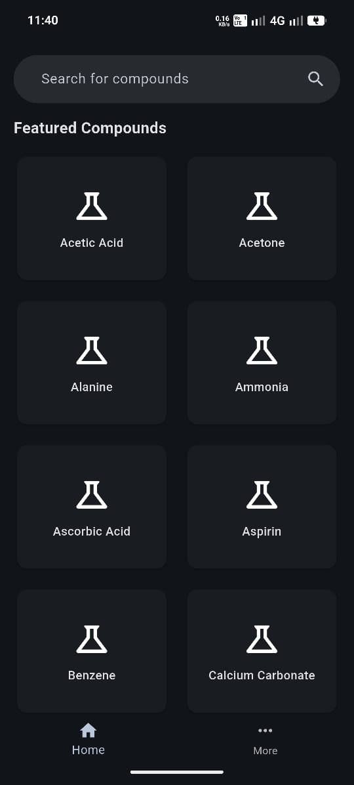
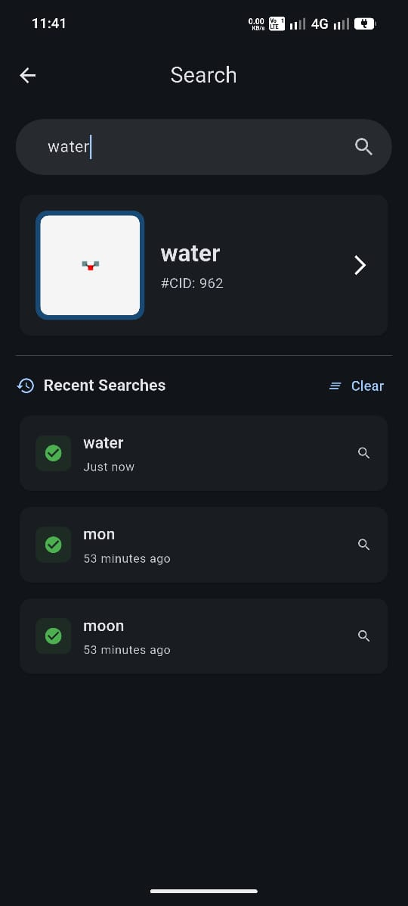
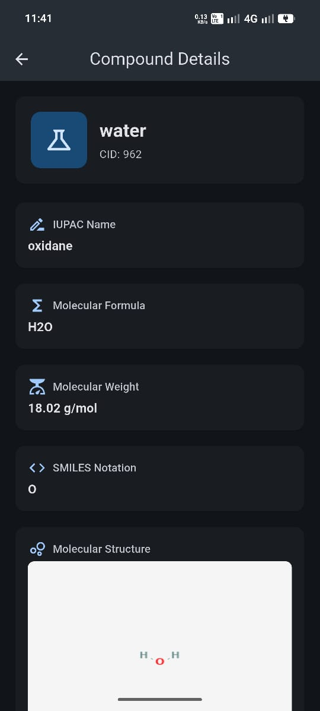
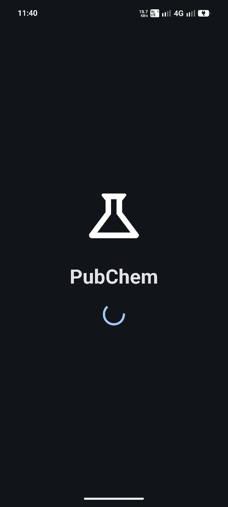
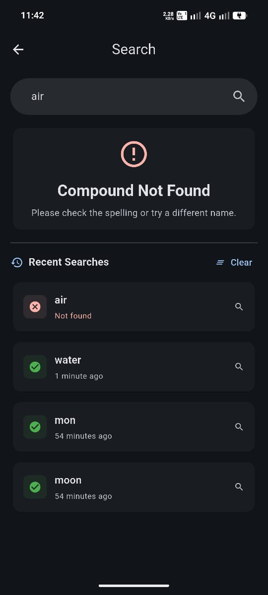
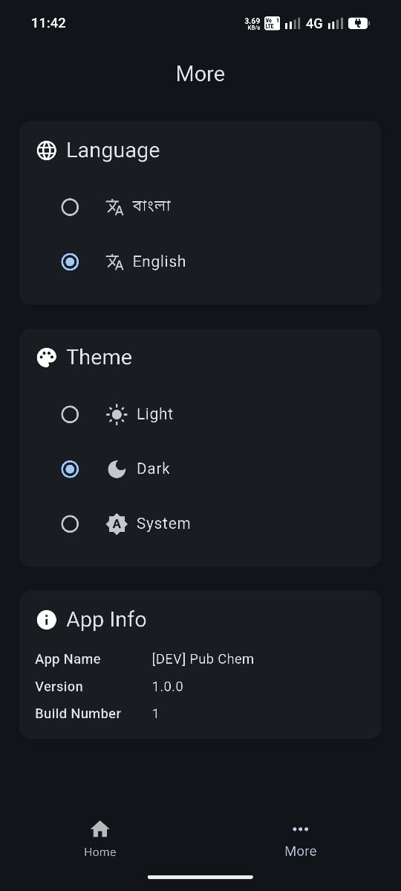

# Pub Chem - Chemical Info System 🧪

---

## App Overview

**Pub Chem** is a cross-platform Flutter app that provides chemical compound information using the [PubChem REST API](https://pubchem.ncbi.nlm.nih.gov/docs/pug-rest). It allows users to:

- **Search** for chemical compounds by name and view basic information (CID, structure image, molecular formula, etc.)
- **Browse** featured compounds (e.g., Aspirin, Caffeine, Glucose) from the home screen
- **View details** of compounds including molecular formula, weight, SMILES notation, and structure images
- **Track recent searches** with success/failure status, stored locally
- **Customize** theme (light/dark/system) and language (English/Bengali)
- **Access app info** including version details on the More screen

The app runs on **iOS and Android**.

---

## Architecture

The project follows **Clean Architecture** with feature-based organization:
- **Presentation Layer (view)**: BLoC state management + UI widgets
- **Domain Layer**: Business logic and entities
- **Data Layer**: API integration and caching

```
lib/
├── app/                    # Core app configuration
│   ├── config/             # Environment (dev/staging/prod), service locator
│   ├── network_service/    # Dio API client, endpoints
│   ├── router/             # GoRouter routes
│   └── view/               # App-wide UI (theme, locale)
├── compound_details/       # Compound feature
│   ├── data/               # Models, repositories, cache, API sources
│   ├── domain/             # Entities, repository contracts
│   └── view/               # Screens, BLoC, widgets
├── home/                   # Home screen with featured compounds
├── search/                 # Search with recent history
├── more/                   # Settings (theme, language, app info)
├── navbar/                 # Bottom navigation
└── splash/                 # Splash screen
```

### Key patterns and technologies

| Layer | Technology |
|-------|------------|
| **State management** | BLoC / Cubit (flutter_bloc) |
| **Dependency injection** | GetIt (service locator) |
| **Navigation** | GoRouter |
| **Networking** | Dio |
| **Data modeling** | Freezed, json_serializable |
| **Localization** | flutter_localizations (ARB) |
| **Local storage** | shared_preferences |

### Data flow

1. **compound_details**: UI → BLoC → Repository → Source (API / Cache) → back up the chain
2. **Recent search**: Stored via `shared_preferences` and managed by `RecentSearchService`
3. **Compound cache**: In-memory cache for compound details to reduce API calls

---

## How to Run the Project

### Prerequisites

- [Flutter SDK](https://flutter.dev/docs/get-started/install) (^3.35.0)
- Dart SDK ^3.10.0

### Setup

1. **Clone the repository**
   ```sh
   git clone <repository-url>
   cd pub_chem
   ```

2. **Install dependencies**
   ```sh
   flutter pub get
   ```

3. **Generate code** (Freezed, json_serializable)
   ```sh
   dart run build_runner build --delete-conflicting-outputs
   ```

### Run the app

The project supports 3 flavors: **development**, **staging**, and **production**. All use the same PubChem API base URL; flavors differ by logging and environment config.

Use the launch configuration in VSCode/Android Studio, or run:

```sh
# Development (recommended for local development)
flutter run --flavor development --target lib/main_development.dart

# Staging
flutter run --flavor staging --target lib/main_staging.dart

# Production
flutter run --flavor production --target lib/main_production.dart
```
## 📱 Screenshots

| Home Screen                                                                   | Compound Search                                                                     | Compound Details                                                                      |
|-------------------------------------------------------------------------------|-------------------------------------------------------------------------------------|---------------------------------------------------------------------------------------|
|  |  |  |

| Splash Screen                                                                     | Error Handling                                                                     | More Screen                                                                   |
|-----------------------------------------------------------------------------------|------------------------------------------------------------------------------------|-------------------------------------------------------------------------------|
|  |  |  |

---
## ‍� Author

**Monir Haider Helalee**
- Portfolio: [monirdev.com](https://monirdev.com)